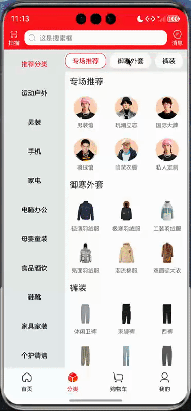

<div align="center">

# jdMall

### 高仿京东商城 · HarmonyOS (ArkTS) 学习项目

基于鸿蒙官方状态管理 V2 + Stage 模型构建的高仿京东商城 App，涵盖首页、分类、购物车、我的、商品详情、WebView 等核心页面，配套 Node.js Mock 服务端，开箱即跑。

`HarmonyOS 6.0.2` · `ArkTS` · `API 18+`

</div>

---

## 目录

- [项目简介](#项目简介)
- [功能特性](#功能特性)
- [技术栈](#技术栈)
- [项目架构](#项目架构)
- [目录结构](#目录结构)
- [开发环境](#开发环境)
- [快速开始](#快速开始)
- [Mock 接口清单](#mock-接口清单)
- [效果展示](#效果展示)
- [第三方框架](#第三方框架)
- [关联项目](#关联项目)
- [声明](#声明)

---

## 项目简介

本项目是一个 **HarmonyOS (鸿蒙) 高仿京东商城** 学习项目，旨在通过完整的电商业务场景实践 ArkTS 开发范式。

核心技术实践包括：

1. **鸿蒙官方状态管理** — 基于 `@State` / `@Prop` / `@StorageProp` + `DataSource` 驱动 `LazyForEach`，无额外状态管理框架
2. **`@hzw/zrouter` 路由管理** — 基于 `Navigation` 导航栈的声明式路由，编译期自动注册页面
3. **`@ohos/axios` 网络封装** — 统一请求/响应拦截器、泛型 `BaseResponse<T>` 解包、错误映射
4. **Node.js Mock 服务端** — 内置 `mock_server` 模块，提供首页、分类、购物车、详情、我的等全量接口
5. **沉浸式安全区适配** — `AppStorage` 全局存储 `safeTop` / `safeBottom`，各页面 `@StorageProp` 读取

## 功能特性

| 页面 | 功能说明 |
|------|---------|
| **首页** | 可折叠搜索头 · Banner 轮播 · 广告图 · 19 宫格菜单双页轮播 · 顶部 Tab（精选/新品/直播/实惠/进口）· 瀑布流商品 · 下拉刷新 · 回到顶部 |
| **分类** | 左侧一级分类列表 · 右侧二级横向胶囊 Tab · 三级分类网格 · 滚动联动 |
| **购物车** | 店铺分组商品列表 · 选择框 · 数量步进器 · 「猜你喜欢」瀑布流 |
| **我的** | 用户头部 · 订单功能九宫格 · 固定吸顶头渐显 · 多推荐 Tab + 瀑布流 |
| **商品详情** | SKU 色选 Swiper · 价格/评价/图文详情 · 「商品/评价/详情/推荐」锚点 Tab · 店内优选 |
| **WebView** | 通用 H5 容器 · 自动注入状态栏/安全区参数 · JS Bridge 通信 |

## 技术栈

| 类别 | 技术 |
|------|------|
| 编程语言 | ArkTS (TypeScript 超集，强类型) |
| 应用模型 | Stage 模型 |
| 状态管理 | 鸿蒙官方 V2（`@State` / `@Prop` / `@StorageProp` / `DataSource`） |
| 路由框架 | `@hzw/zrouter` (Navigation 声明式路由) |
| 网络框架 | `@ohos/axios` (统一封装 `RequestUtil`) |
| 图片加载 | `@ohos/imageknife` |
| 工具库 | `@pura/harmony-utils` |
| 弹窗组件 | `@pura/harmony-dialog` |
| WebView 桥接 | `@yue/webview_javascript_bridge` |
| Mock 服务 | `webpack-plugin-mock` (Node.js) |

## 项目架构

```
┌─────────────────────────────────────────────────────┐
│                   EntryAbility                        │
│   初始化 AppUtil / DialogHelper / ZRouter             │
│   加载 pages/Index · 设置沉浸式全屏 · safeTop/Bottom    │
└──────────────────────┬──────────────────────────────┘
                       │
              ┌────────▼────────┐
              │  Index.ets       │  Navigation(ZRouter) + Tabs(4 Tab)
              └────────┬────────┘
        ┌──────────┬───┴───────┬──────────────┐
        ▼          ▼           ▼              ▼
     首页        分类        购物车          我的
   homeService  categoryService  cartService  mineService
        │          │              │              │
        │     ┌────▼──────────────▼──────────────▼───┐
        │     │   CommodityList (common 公共组件)       │  瀑布流商品列表 · 跨页面复用
        │     └──────────────┬──────────────────────┘
        │                    ▼
        │           commonService → POST /common/queryGoodsListByPage
        │
        └── 点击商品 ──► ZRouter ──► goods_detail_page ──► detailService
                                                        │
                                               POST /detail/queryGoodsDetail

        ┌── 宫格菜单点击 ──► ZRouter ──► common_webview ──► WebView 加载 H5

        所有请求 ──► RequestUtil(@ohos/common) ──► axios 实例 ──► EnvConfig.baseUrl ──► mock_server(:8091)
```

**关键设计**：

- **多模块架构** — `common` (HAR 公共模块) + `entry` (HAP 入口模块)，公共能力统一通过 `common/Index.ets` 桶导出
- **`CommodityList` 核心复用组件** — 首页、购物车、我的、详情页 4 处复用，通过 `categoryCode` 区分不同商品流
- **统一网络层** — 请求/响应拦截器 + 泛型 `BaseResponse<T>` 自动解包，业务层只处理 `data`
- **声明式路由** — `@ZRoute` 注解 + `route_map.json` 映射，插件编译期自动生成 NavDestination 模板

## 目录结构

```
jdMall/
├── AppScope/                        # 应用级配置
│   └── resources/base/
│       ├── element/string.json      # app_name = "jdMall"
│       └── media/                  # 应用图标 & 全局图片资源 (40+ PNG)
├── entry/                           # HAP 入口模块
│   └── src/main/
│       ├── ets/
│       │   ├── entryability/        # EntryAbility (入口)
│       │   ├── pages/
│       │   │   ├── Index.ets       # 主框架 (4 Tab + Navigation)
│       │   │   ├── home/home.ets
│       │   │   ├── category/category.ets
│       │   │   ├── cart/cart.ets
│       │   │   ├── mine/mine.ets
│       │   │   ├── goods/detail/goodsDetail.ets
│       │   │   └── webview/webview.ets
│       │   ├── service/             # 业务 Service (每页一个)
│       │   ├── modifier/           # AttributeModifier 封装
│       │   └── _generated/         # ZRouter 自动生成的路由模板
│       ├── resources/
│       │   ├── base/profile/
│       │   │   ├── main_pages.json # 页面注册
│       │   │   └── route_map.json  # 路由映射
│       │   └── base/element/        # 颜色/字符串/主题色
│       └── module.json5            # 模块配置 (权限: INTERNET, GET_NETWORK_INFO)
├── common/                          # HAR 公共模块 (@ohos/common)
│   ├── Index.ets                    # 桶导出 (统一出口)
│   └── src/main/ets/
│       ├── constants/
│       │   ├── EnvConstants.ets    # ★ 环境配置 (baseUrl — 运行前需修改 IP)
│       │   ├── RouterConstants.ets # 路由名常量
│       │   ├── StyleConstants.ets  # 样式常量
│       │   └── GridConstants.ets   # Grid 栅格常量
│       ├── utils/
│       │   ├── request/            # ★ axios 封装 (RequestUtil + 拦截器)
│       │   ├── DataSource.ets      # LazyForEach 数据源实现
│       │   └── index.ets           # 通用工具函数
│       ├── service/common.ets      # 公共分页商品接口
│       └── components/             # 通用组件
│           ├── CommodityList.ets   # ★ 瀑布流商品列表 (核心复用)
│           ├── RefreshComponent.ets
│           ├── LoadMoreFooter.ets
│           ├── FloatingBackTop.ets
│           ├── StepperComponent.ets
│           └── CommonDotIndicator.ets
├── mock_server/                     # Node.js Mock 服务端
│   └── api/                        # JSON 接口数据 (Mock.js 语法)
├── images/                          # README 效果图 (GIF)
├── build-profile.json5             # 工程构建配置
├── oh-package.json5                # 工程依赖
└── hvigorfile.ts                   # Hvigor 构建脚本 (ZRouter 插件配置)
```

## 开发环境

| 项 | 版本 |
|----|------|
| DevEco Studio | 6.0.2 Release |
| HarmonyOS SDK | 6.0.2 (API 22) |
| 最低兼容版本 | 5.1.0 (API 18) |
| Node.js (Mock) | v18.20.6+ |

## 快速开始

### 1. 启动 Mock 服务端

```bash
cd mock_server
npm install
npm run mock
```

服务启动后监听 **8091** 端口。

### 2. 修改后端地址

打开 `common/src/main/ets/constants/EnvConstants.ets`，将 `baseUrl` 改为本机局域网 IP：

```typescript
export class EnvConfig {
  static readonly baseUrl: string = 'http://<你的本机IP>:8091'
}
```

> 设备与电脑需在同一局域网下；模拟器可使用 `127.0.0.1`。

### 3. 编译运行

1. 使用 DevEco Studio 打开项目根目录
2. 连接鸿蒙真机或启动模拟器
3. 点击 **Run** 编译安装

## Mock 接口清单

| 业务域 | 方法 | 端点 | 说明 |
|--------|------|------|------|
| 首页 | POST | `/home/queryHomePageInfo` | Banner、广告图、19 宫格菜单、5 个 Tab |
| 分类 | POST | `/category/list` | 26 个一级分类 |
| 分类 | POST | `/category/queryContentByCategory` | 二级/三级分类内容 |
| 购物车 | POST | `/cart/queryCartGoodsList` | 店铺分组商品列表 |
| 购物车 | POST | `/cart/queryMaybeLikeList` | 猜你喜欢 |
| 详情 | POST | `/detail/queryGoodsDetail` | SKU、评价、图文详情 |
| 详情 | POST | `/detail/queryStoreGoodsList` | 店内优选 |
| 我的 | POST | `/mine/queryMineInfo` | 功能宫格 + 推荐 Tab |
| 我的 | POST | `/mine/queryRecommendList` | 推荐商品列表 |
| 公共 | POST | `/common/queryGoodsListByPage` | 分页商品 (每页 15 条，共 5 页) |
| 公共 | POST | `/common/login` | 登录 (返回 token + 用户信息) |

所有接口统一返回 `{ "code": "0", "msg": null, "data": { ... } }` 结构。

## 效果展示

| 首页 | 分类 | 购物车 |
|:---:|:---:|:---:|
|  |  |  |

| 我的 | 商品详情 | WebView |
|:---:|:---:|:---:|
|  |  |  |

## 第三方框架

| 库 | 版本 | 功能 |
|----|------|------|
| `@hzw/zrouter` | ^1.9.0 | 路由管理 (Navigation 声明式路由) |
| `@ohos/axios` | ^2.2.7 | 网络请求 |
| `@pura/harmony-utils` | ^1.4.0 | 工具库 (AppUtil / ToastUtil / LogUtil 等) |
| `@ohos/imageknife` | ^3.2.8 | 图片加载与缓存 |
| `@pura/harmony-dialog` | ^1.1.8 | 弹窗 / 加载 / Toast 组件 |
| `@yue/webview_javascript_bridge` | ^1.0.1 | WebView 与 JS 通信桥 |

## 关联项目

同款业务逻辑的其他平台版本：

- **Android Kotlin 版本**：[jd_mall](https://github.com/GuoguoDad/jd_mall)
- **Flutter 版本**：[jd_mall_flutter](https://github.com/GuoguoDad/jd_mall_flutter)

## 声明

> ⚠️ 本 APP 仅限于学习交流使用，请勿用于其它商业用途。
>
> ⚠️ 项目中使用的图片及字体等资源如有侵权请联系作者删除。
>
> ⚠️ 如使用本项目代码造成侵权与作者无关。
